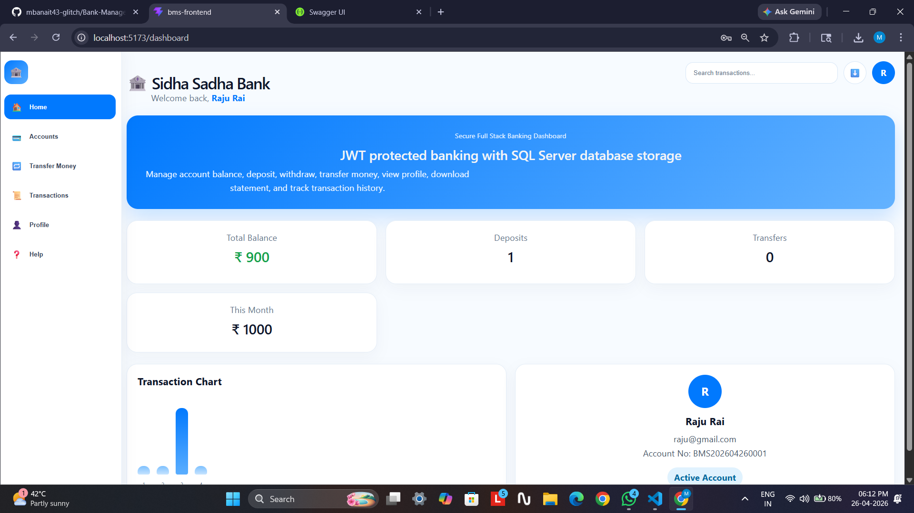
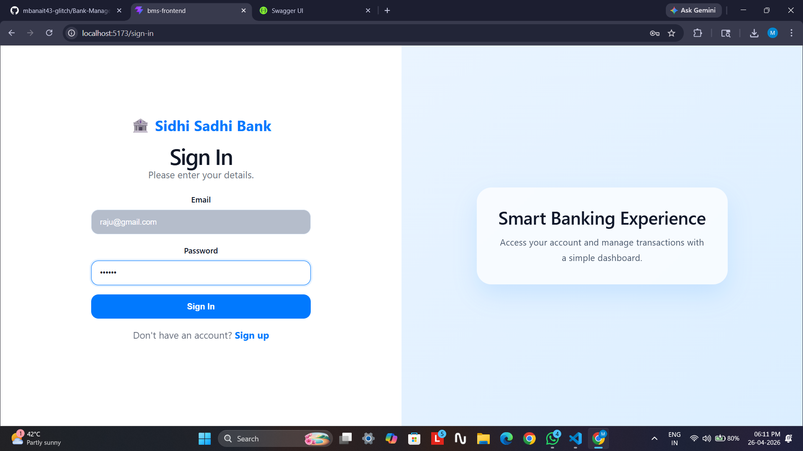
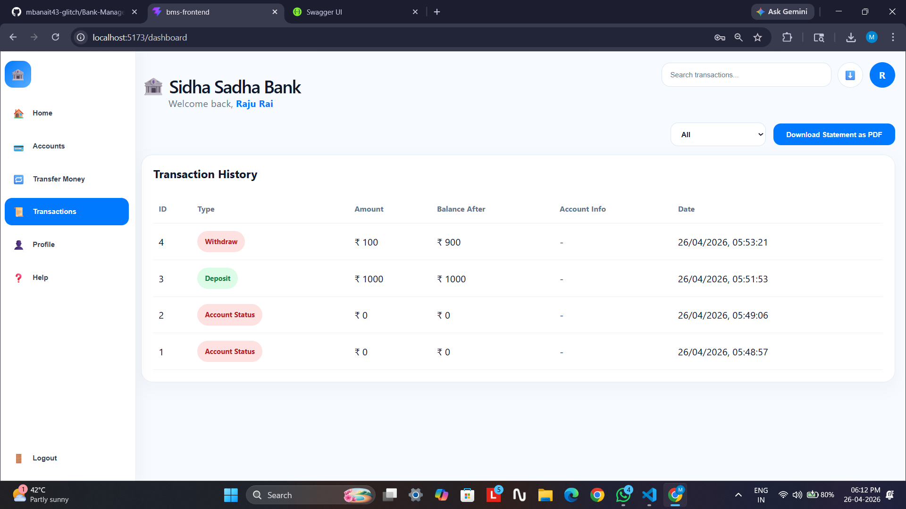
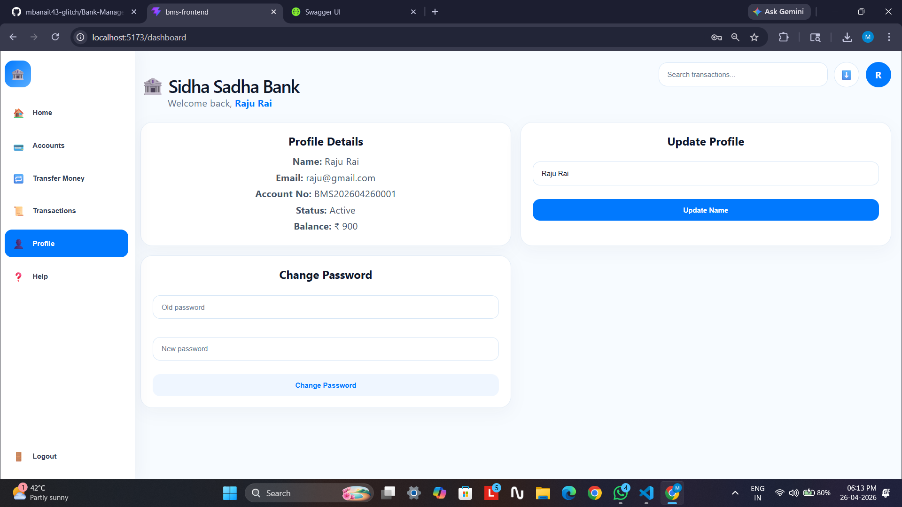
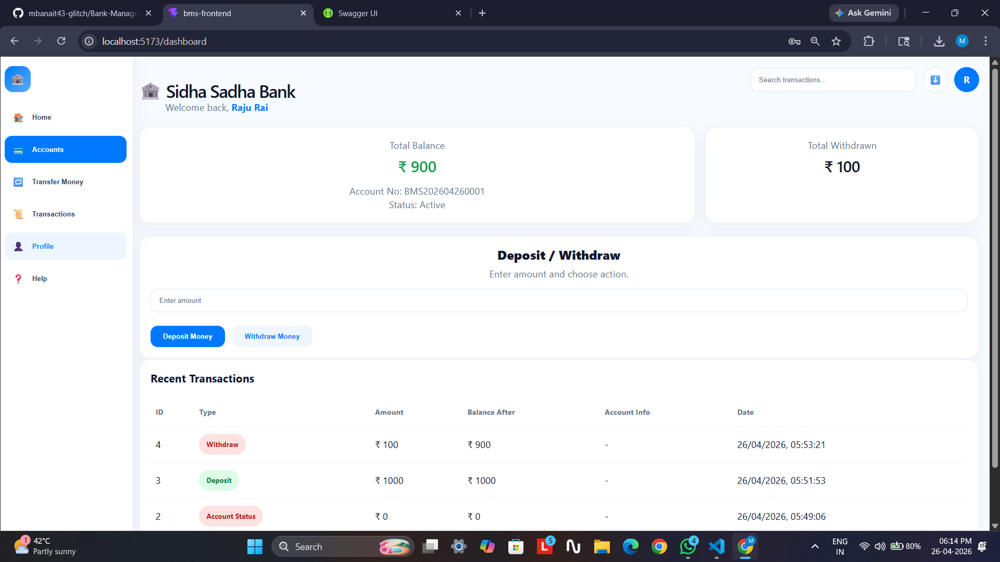
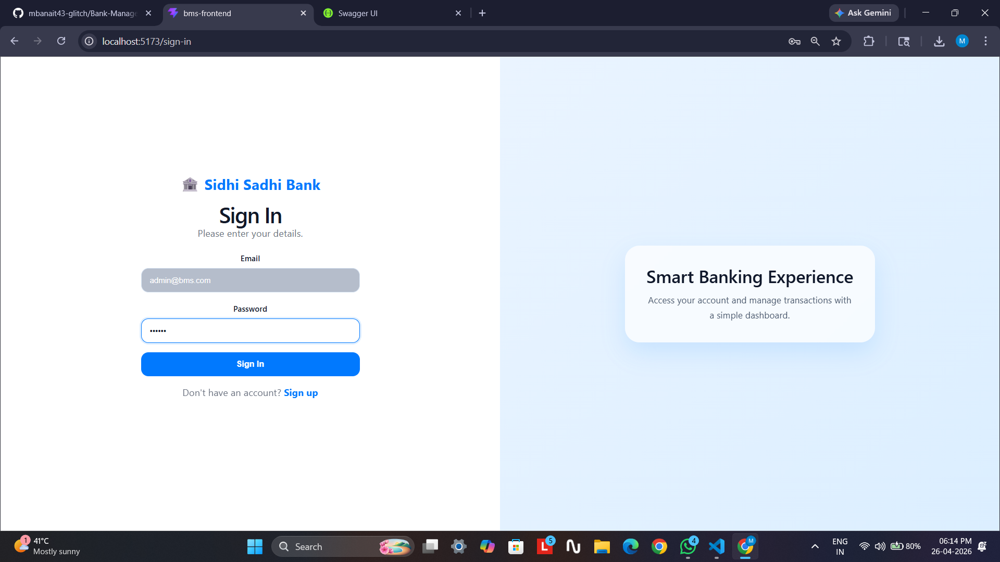
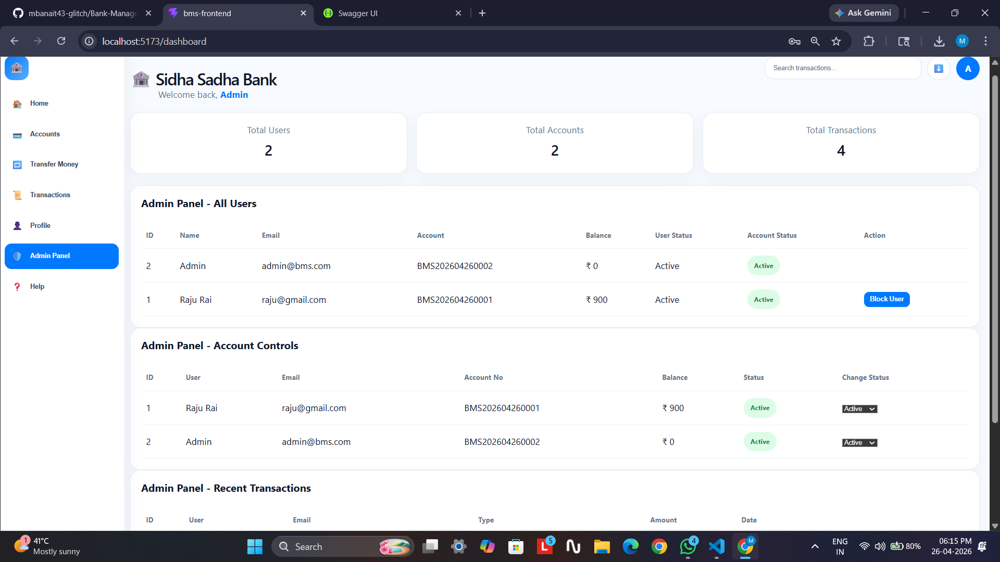

# 🏦 Bank Management System

A full-stack banking application built using React.js, ASP.NET Core Web API, and SQL Server. It supports secure authentication and core banking operations.

## 🚀 Tech Stack
- React.js (Frontend)
- ASP.NET Core Web API (Backend)
- SQL Server (Database)
- Entity Framework Core
- JWT Authentication

## ✨ Features
- User Registration & Login
- Deposit, Withdraw, Transfer Money
- Transaction History
- Profile Management
- Admin Panel (Users, Accounts, Transactions)
- Account Status (Active / Hold / Blocked)

## 📸 Screenshots

## ⚙️ Run Project Locally

### Backend
cd BMSApi
dotnet run

### Frontend
cd bms-frontend
npm install
npm run dev

## 📌 Notes
- SQL Server running hona chahiye
- Connection string appsettings.json me check karna
- Backend: http://localhost:5265
- Frontend: http://localhost:5173

## 🎯 Summary
This project demonstrates full-stack development with secure authentication, database integration, and role-based access control.
